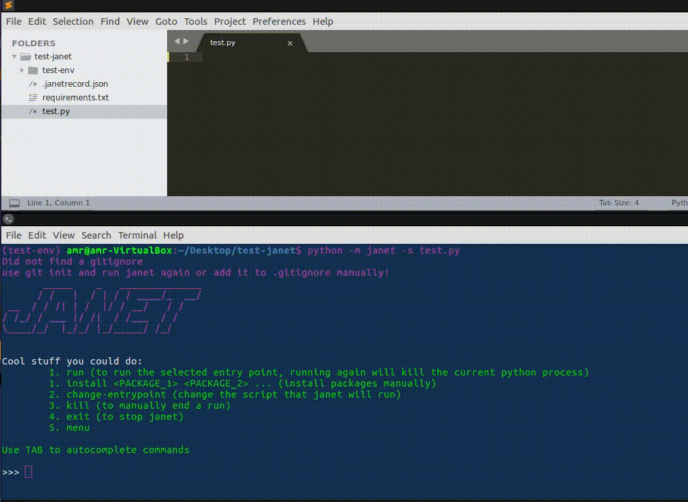

# Janet

Janet is a powerful python project manager that allows python developers
to focus more on scripting and less on piping packages and managing a project. janet will auto-install
pip packages when a .py file is saved and will generate a requirements.txt file
automatically, it will also monitor all your scripts for new packages and install them in the background. 

janet currently supports ```python 3```

## How do I use it?

To get started with janet, you need to install the package:

```bash
pip install janet
```

once installed, cd to your project directory and run the following:

```bash
python -m janet -p <PROJECT_PATH, default="current directory"> -s <SCRIPT>
```
the ```-s``` flag specifies which script to run when the ```run``` command is issued,
this is useful if your project is a webserver. You can change the script that is run, this is discussed below in the "commands" section.

you will then be greeted with a menu of commands, that's it!


you can now start working on your project, create new files, delete files, do whatever it is you want, janet will silently track your project and download dependecies silently once a file is saved.




---
**NOTE**

we recommand that you create your projects in a virtualenv and install janet on your virtualenv, it simplifies the scope of janet's tracking. future releases will hopefully not require this.

---


## What can janet do?
janet has the following commands:

	- 'run' to run the script you defined using the -s flag
	- 'install <PACKAGE_1> <PACKAGE_2>' to manually install packages (yuck)
	- 'change-entrypoint' to change the script 'run' will run
	- 'kill' to kill run if things go run
	- 'menu' to see all the commands you can run
	- 'exit' to stop janet (she will still love you though)


oh, did we mention janet can autocomplete commands??


## I am seeing this weird ```jrecord.json```, WTH is that ?

When you initialize janet in your project directory, it creates a ```jrecord.json``` file that stores the last time a file was modified, when a file is saved the last modified date will also change which will notify janet to check for new packages in the saved file. a janetrecord is meant to be a simple record janet could refer to when initialized, if it is not present then janet will create a new record automatically.


Oh, and it will add it to your .gitignore automatically, janet's got you!


## Wow, janet is truly perfect!

not reaaaaaalllly, janet is still work in progress and more features will be added soon, I welcome any contributions to this repo!

Janet still has some issues resolving some packages were the name of the imported module does not match the package name. Future versions will address this


